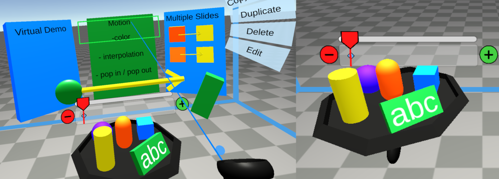

# VirtualDemonstrator
A tool for building presentations in virtual reality.

Authors
- Max Omdal
- David Kinney
- Kiet Tran
- Evan Suma Rosenberg 

## Usages
Virtual Demonstrator is a spatial environment for creating presentations that improves upon slideware technology like PowerPoint for expressing spatial concepts. There are several components that make up the users interaction space.

### Modes
**Creation Mode**: used for building presentation slides
**Presentation Mode**: currently present mode can only view the presentation created previously. Future versions will allow many presentations to be saved and loaded dynamically.

### Element Menu
The 3D Menu is displayed above the left controller. With the right controller, the user can raycast and select objects from the menu to create instances of them on the current slide.

### Properties Menu
When an object is selected, a properties menu will appear, allowing users to perform operations like delete, duplicate, change color.

### Controller Buttons
**Left Controller**

**Y** - switch between Creation and Presentation mode.

**Thumbstick** - move left or right to move between slides

**Grip** - when an object is selected, allows you to rotate. Hold both grips simultaneously to scale.

**Right Controller**

**Thumbstick** - move forward or backward to push in the direction of the controller.

**Trigger** - Select. Multiple objects can be selected at once. Select an object if you would like to manipulate it. Press the trigger on any empty space to deselect all.

**Grip** - Attach as Child. When objects are selected, they will be attached as a child to the right controller, allowing for easy translation. Hold both grips simultaneously to scale.